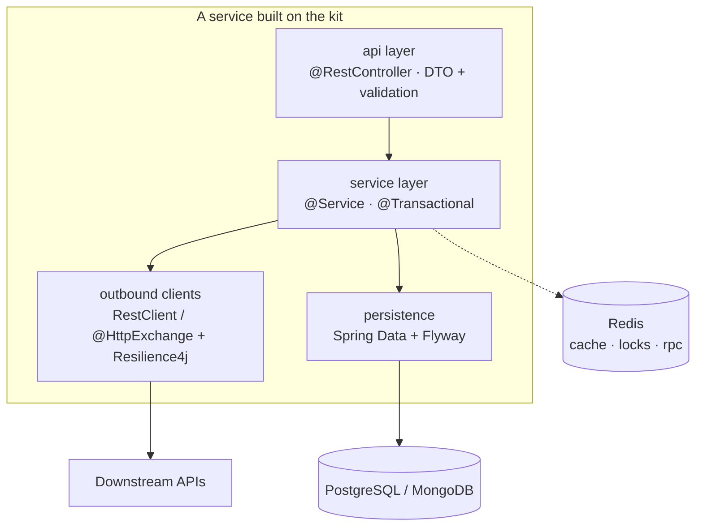

# spring-backend-kit

Paved-road foundation for Spring Boot backend services: a **BOM** + thin
**Spring Boot starters** + a **reference service** that proves they compose.

Starting a new service means: generate from start.spring.io, import the BOM,
pick the starters you need, write domain logic. Nothing else.

## Why

We build many backend services with the same shape — REST API → service layer
→ outbound clients / storage. A mature set of building blocks for this already
exists in our Python stack (config conventions, REST client layer, Redis
cache/locks/RPC, background workers, test kit). This repo is the same
foundation for the JVM.

## How it is delivered

- **`kit-bom`** — a Bill of Materials as the single version-alignment point.
- **Thin starters, not a god `common.jar`** — each capability is its own
  `*-spring-boot-starter` with auto-configuration and overridable defaults
  ([ADR-0001](docs/adr/0001-starters-over-shared-jar.md)).
- **`sample-service`** — an always-green reference service wired with every
  starter; living documentation and upgrade canary.

## Architecture at a glance

Dependencies point one way (api → service → outbound/persistence), errors
follow RFC 9457 `ProblemDetail`, and the layer rules are **enforced by a
shared ArchUnit rule set** — not by convention
([ADR-0002](docs/adr/0002-layer-rules-enforced-by-archunit.md)).

Full architecture documentation (arc42): **[docs/architecture.md](docs/architecture.md)**
· Decisions (MADR): **[docs/adr/](docs/adr/README.md)**

## Modules

| Module | What it gives | Status |
|---|---|---|
| `kit-bom` | Version alignment for all services | design |
| `core-starter` | RFC 9457 error model, correlation-id logging, config conventions | design |
| `observability-starter` | Actuator + Micrometer/Prometheus, domain counters, Sentry wiring | design |
| `resilience-starter` | Default timeouts, retries, circuit breakers for outbound HTTP | design |
| `redis-starter` | Key router, cache TTL config, Redisson locks, ShedLock | design |
| `redis-rpc-starter` | Request/reply RPC over Redis Pub/Sub | design |
| `worker-starter` | Scheduled loops, queue consumers, graceful shutdown | design |
| `test-kit` | Testcontainers bases, WireMock, shared ArchUnit rules | design |
| `sample-service` | Reference CRUD service, OpenAPI via springdoc | design |

What the kit deliberately does **not** reimplement (`@Cacheable`, Spring Data,
`@HttpExchange`, `JsonNullable` + dirty checking, …) — see
[architecture.md §4](docs/architecture.md#4-solution-strategy).

## Roadmap

- [ ] Gradle multi-module skeleton + version catalog + `kit-bom`
- [ ] `sample-service`: CRUD with PostgreSQL, Flyway, Testcontainers, springdoc
- [ ] `core-starter` → `test-kit` → `observability-starter`
- [ ] `redis-starter` → `resilience-starter` → `worker-starter` → `redis-rpc-starter`
- [ ] CI + publishing to GitHub Packages

## License

[MIT](LICENSE)
