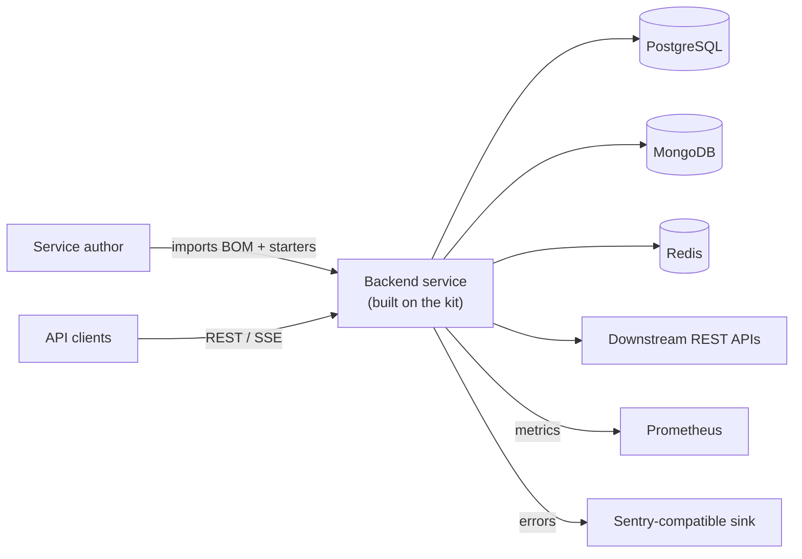
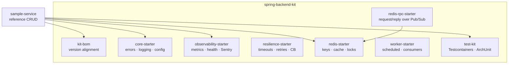
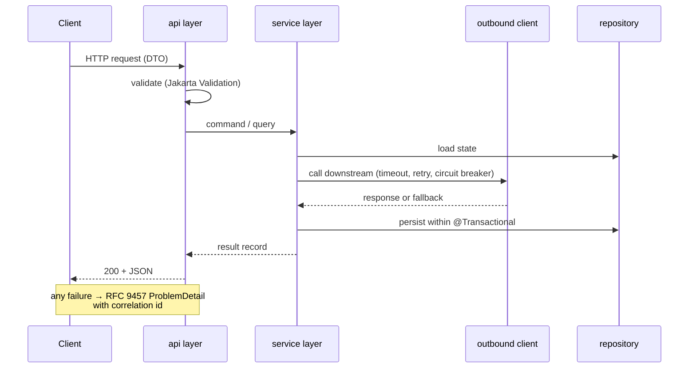

# Architecture Documentation

Structure follows [arc42](https://arc42.org/) (sections that carry no
information at this stage are marked *n/a for now* rather than padded).
Diagrams follow the [C4 model](https://c4model.com/) levels: context →
containers → components.

## 1. Introduction and Goals

`spring-backend-kit` is a paved-road foundation for building Spring Boot
backend services: one BOM, a set of thin starters, and a reference service.
The goal is that a new service contains **only domain logic** — every
cross-cutting concern (errors, observability, resilience, caching, locking,
testing) comes from the kit with sensible defaults.

### 1.1 Quality goals (highest first)

| # | Quality | Scenario that must hold |
|---|---------|------------------------|
| 1 | Time-to-service | A new CRUD service goes from `start.spring.io` to deployed Docker container in under one day using the kit |
| 2 | Maintainability | Upgrading a Spring Boot minor version = bumping the BOM in one place; services follow by re-resolving |
| 3 | Reliability | An outage of a downstream API degrades the service (circuit breaker opens, fallback answers) instead of cascading |
| 4 | Observability | Every silent-failure path has a metric; funnel/loss counters catch logic bugs that raise no exception |
| 5 | Testability | Integration tests run against real PostgreSQL/MongoDB/Redis via Testcontainers on any dev machine, no shared environments |

### 1.2 Stakeholders

| Who | Concern |
|-----|---------|
| Service authors | Start fast, override defaults without forking the kit |
| Operators | Uniform health endpoints, metrics and error format across all services |
| Reviewers / clients | Predictable structure: every service reads the same way |

## 2. Constraints

- Java 21 (LTS), Spring Boot 3.x, Gradle multi-module with a version catalog.
- Services ship as Docker containers; modest single-node deployments must be
  first-class (no Kubernetes assumption).
- PostgreSQL or MongoDB for persistent state; Redis strictly for
  cache / locks / queues / RPC — never as primary storage.
- Artifacts published to GitHub Packages; semantic versioning.

## 3. Context (C4 level 1)

## 4. Solution Strategy

| Problem | Strategy | Rationale |
|---|---|---|
| Sharing platform code | BOM + thin auto-configured starters ([ADR-0001](adr/0001-starters-over-shared-jar.md)) | The idiomatic Spring mechanism; services pay only for what they import |
| Keeping services uniform | One layered shape, enforced by ArchUnit in CI ([ADR-0002](adr/0002-layer-rules-enforced-by-archunit.md)) | Rules that only live in documentation decay |
| Concurrency model | Blocking style on virtual threads ([ADR-0003](adr/0003-virtual-threads-over-webflux.md)) | Imperative simplicity with async-grade throughput |
| Avoiding NIH | Reuse Spring's own answer wherever one exists | See table below |

Deliberately **not** reimplemented — Spring already covers it:

| Need | Spring answer |
|---|---|
| Config sections per component | `@ConfigurationProperties(prefix = "...")` + profiles |
| Method-level cache | `@Cacheable` + Redis backend |
| Repositories / query methods | Spring Data (JPA / MongoDB) |
| Outbound HTTP clients | `RestClient` / declarative `@HttpExchange` interfaces |
| Partial updates (PATCH) | `JsonNullable` + JPA dirty checking |
| Transactions | `@Transactional` |
| Server-sent events | `SseEmitter` / `Flux<ServerSentEvent>` |
| Object mapping | MapStruct |

## 5. Building Block View (C4 level 2)

Inside every service the component layout is fixed (C4 level 3):

| Layer | Spring construct | Allowed to call |
|---|---|---|
| api | `@RestController`, DTO + Jakarta Validation | service |
| service | `@Service`, `@Transactional` | outbound, persistence, other services |
| outbound | `RestClient` / `@HttpExchange` + Resilience4j | external systems only |
| persistence | Spring Data repositories + Flyway | database only |

## 6. Runtime View

Happy path and failure path of a typical request:

## 7. Deployment View

One service = one Docker container. `docker-compose.yml` in each service wires
the service with its PostgreSQL/MongoDB/Redis for local and single-node
production use. Metrics are scraped from `/actuator/prometheus`; health checks
from `/actuator/health`. *(Expanded when `sample-service` lands.)*

## 8. Crosscutting Concepts

- **Error model** — RFC 9457 `ProblemDetail` everywhere; no ad-hoc error JSON.
  Exception → problem mapping lives in `core-starter`.
- **Observability** — every layer owns its failures: outbound reports
  degradation counters, services count lost domain outcomes, workers log
  top-level exceptions. Micrometer for metrics, MDC correlation id in every
  log line, Sentry for exceptions.
- **Resilience** — outbound calls get defaults (connect/read timeouts,
  bounded retries with jitter, circuit breaker) from `resilience-starter`;
  overrides per client in `application.yml`.
- **Caching and locking** — Redis only, via `@Cacheable` with TTL config and
  Redisson locks; scheduled jobs guarded by ShedLock.
- **Testing** — unit tests plain JUnit 5; integration tests extend `test-kit`
  bases (Testcontainers); architecture tests run the shared ArchUnit rules.

## 9. Architecture Decisions

Kept as MADR records in [`docs/adr/`](adr/README.md).

## 10. Quality Requirements

The quality tree is §1.1; measurable checks:

| Quality | Check |
|---|---|
| Time-to-service | Walk through the `sample-service` README from scratch, stopwatch under one day |
| Maintainability | Dependabot bump of the BOM leaves `sample-service` green |
| Reliability | `sample-service` integration test kills the WireMock downstream and asserts fallback + open circuit |
| Observability | ArchUnit rule: no `catch` block without a metric or rethrow in outbound layer |
| Testability | `./gradlew check` needs Docker and nothing else |

## 11. Risks and Technical Debt

| Risk | Mitigation |
|---|---|
| Design not yet validated by code | `sample-service` is built first, kit modules are extracted from it — not designed in the abstract |
| Single maintainer | Small modules, exhaustive READMEs per starter, boring technology choices |
| Custom Redis RPC protocol | Versioned message envelope from day one; considered replaceable by HTTP or a broker |

## 12. Glossary

| Term | Meaning |
|---|---|
| Paved road | A default, fully-supported way of building a service; deviation is possible but costs you the support |
| BOM | Bill of Materials — a Maven/Gradle platform that pins dependency versions in one place |
| Starter | A Spring Boot module that auto-configures a capability when present on the classpath |
| ADR / MADR | (Markdown) Architectural Decision Record — a short document capturing one decision and its context |
| ProblemDetail | RFC 9457 standard JSON error body, natively supported by Spring 6+ |
